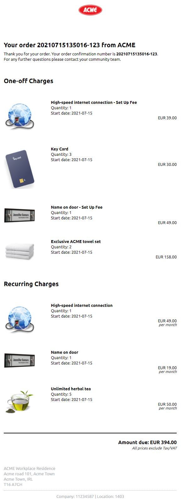
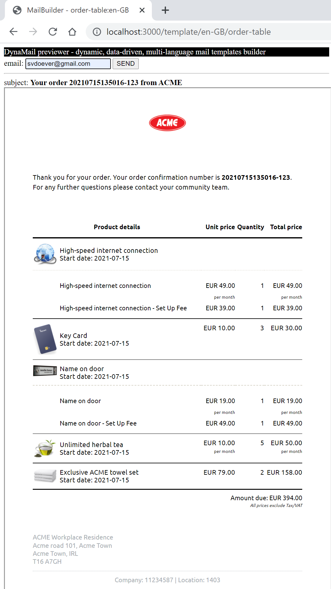
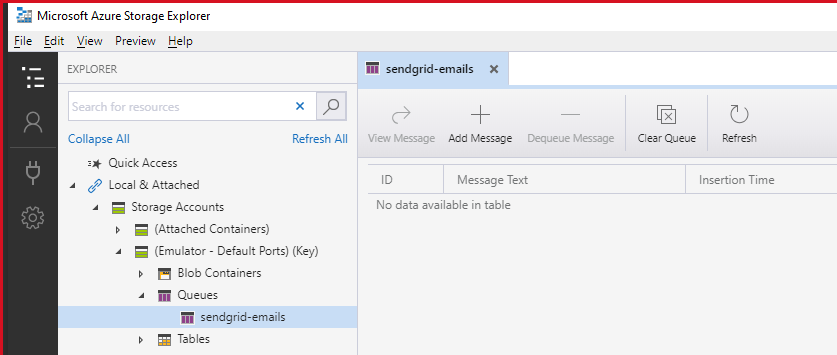

# DynaMail quickstart
To start template development:

1. `npm install`
2. `npm run bootstrap`
3. copy `.env.sample` to `.env` and set values of `SendGridApiKey` and `SendGridFromAddress`
4. `npm run start`
5. open http://localhost:3000 to see a preview of the email templates with sample data
# DynaMail introduction
**DynaMail** is a system to create, build, deploy and send data-driven, multi-language, template-based emails. Create complex personal transactional emails like this in any language:




In the current implementation an Azure Function with a SendGrid binding is used to send out the email.

# The DynaMail use-case
**DynaMail** is a simple and free solution to send transactional emails. We used it at a customer for sending order emails from Sitecore Experience Commerce in a case where Sitecore Email Experience Manager (EXM) could not be used. Although I never used EXM myself, I think that building good transactional emails is a developer task, and not something that can be done by dragging together blocks in a visual designer.

Building good responsive emails is hard, that is why we used MJML in DynaMail to handle the heavy-lifting of building the email templates. See https://mjml.io/templates for some great examples of what you can achieve with MJML. 

# Using DynaMail
**DynaMail** is not an NPM package you install in your solution, but it is a starter to be embeded within your solution. Copy over the code into a folder DynaMail in your solution, and modify the code!
# Developing email templates
Email templates are developed in the folder `MailTemplates`. New templates should be added to the file `MailTemplates\templates.json`. Have a look at existing templates on the structure of required files and what templates, data and translation files look like. In the browser preview on http://localhost:3000 you can switch between the language versions of a template for the preview.

## Templates folder structure
Templates are managed in the following folder structure:

```
-src
  - Template1
    - data.json          -- sample data used for preview
    - template.mjml      -- the email template in MJML
    - styles.css         -- external styles file for email templates (optional)
    - translations.json  -- multi-language translations file
  - Template2
    - :

```

Email templates are developed using [MJML](https://mjml.io/) and can include language replacement tokens (in the format `${token}`) and [Handlebars](https://handlebarsjs.com/) for templating.

Handlebars extension functions are created in the file `HandlebarsHelpers\index.ts`.

Changes in templates, sample data, styling, translation files and extension functions are detected, and the resulting email is rerendered in the preview website.

## The data
DynaMail is created to handle dynamic data, and use Handlebars to iterate over the data. The structure of the data is application/mail template specific. In this data a fixed structure is injected that is used by DynaMail to construct and send mails:

```json
{
  "_email": {
    "template": "order",
    "language": "en-GB",
    "from": "sender@company.com",
    "to": "mymail@mycompany.com"
  },
  "_environment": {
    "baseUrl": "https://mycompany.com",
    "brand": "My Company"
  },
  :
}
```

Where:
- `_email.template` is the email template to use. This is the name of the folder containing the email template definition `template.mjml`
- `_email.language` is the language to use as defined in `translations.json`. If the language is not found, the fallback language defined in the Azure Function (see `AzureFunctions\local.settings.json`, the field `Values.FallbackLanguage`) is used when sending out the email
- `_email.from` is the email address the email is sent from
- `_email.to` is the email address the email is sent to. Note that only a single email address can be specified
- `_environment.baseUrl` is an optional value, and can be used by the email template as the base URL to be used for referencing images, URLs or documents
- `_environment.brand` is an example of a solution specific environment field

If additional environment values are required for you usecase, extend the `_environment` with additional fields.

## Templates, translations and compilation
To support multi-language mail templates, a `translations.json` file should be available in the template folder, e.g. `MailTemplates\src\order\translations.json`. This translations file might look like:

```json
{
  "en-GB": {
      "subject": "Your order {{OrderConfirmationId}} from {{@root._environment.brand}}",
      "orderReceived": "Thank you for your order. Your order confirmation number is <strong>{{OrderConfirmationId}}</strong>.",
      "furtherQuestions": "For any further questions please contact your community team.",
      "quantity": "Quantity",
      "amountDue": "Amount due",
      "pricesExcludingTax": "All prices exclude Tax/VAT",
      "startDate": "Start date",
      "perMonth": "per month",
      "oneOffCharges": "One-off Charges",
      "recurringCharges": "Recurring Charges",
      "companyId": "Company",
      "locationNumber": "Location"
  },
  "nl-NL": {
      "subject": "Uw bestelling {{OrderConfirmationId}} van {{@root._environment.brand}}",
      "orderReceived": "Bedankt voor uw bestelling. Uw orderbevestigingsnummer is <strong>{{OrderConfirmationId}}</strong>.",
      "furtherQuestions": "Neem voor verdere vragen contact op met uw communityteam.",
      "quantity": "Aantal",
      "amountDue": "Verschuldigd bedrag",
      "pricesExcludingTax": "Alle prijzen zijn exclusief BTW",
      "startDate": "Startdatum",
      "perMonth": "per maand",
      "oneOffCharges": "Eenmalige kosten",
      "recurringCharges": "Periodieke kosten",
      "companyId": "Bedrijf",
      "locationNumber": "Locatie"
  }
}
```

Each language has an entry, with the language entry containing tokens for translation. There is a mandatory token `subject` that is used as the subject for the email sent out.

Note that the translation lines can contain Handlebars expressions as well.

In the email templates, translation tokens should be used as `${token}`, e.g. `${pricesExcludingTax}`.

**DynaMail** has a compilation step where template + language are compiled into a language-specific mail template. All templates to be created are defined in the file `MailTemplates\templates.json`:

```json
{
    "templates": [
        {
            "id": "d-a098231dd3574b2397dea2c032ec4768",
            "name": "order",
            "template": "./src/order/template.mjml",
            "language": "en-GB"
        },
        {
            "id": "d-8cfd87cee57649c39a8b7a9e84ddd8e5",
            "name": "order",
            "template": "./src/order/template.mjml",
            "language": "nl-NL"
        }   
    ]
}
```

Each template definition is compiled into two language-specific files:

- The resulting HTML file, still containing the Handlebars tags (with the `.html` file extension)
- A *subject* file, still containing the Handlebars tags (`.hbs` file extension)

These two files are used by the Azure Function to send out a language-specific email with the translated subject.

For the **order** mail template the following files are generated in the folder `MailTemplates\dist`:

```
MailTemplates\dist\order.en-GB.html
MailTemplates\dist\order.en-GB.subject.hbs
MailTemplates\dist\order.nl-NL.html
MailTemplates\dist\order.nl-NL.subject.hbs
```

## Debugging mail templates
When running `npm run start` in the root folder, a browser can be started on http://localhost:3000 to preview all generated mail templates with the sample data from the `data.json` file.


When a mail template for a given language is selected the following screen appears:



Test emails can be directly sent from the preview website. The configuration as defined in the root file `.env` (sample provided as `.env.sample`) is used for sending out the email:

```
SendGridApiKey=<your sendgrid API key>
SendGridFromAddress=<your approved SendGrid from email address>
```

When testing, you can create an account with SendGrid, and use a personal SendGrid API key to use as value for `SendGridApiKey`.Add also a value `SendGridFromAddress` with the "from" email address.

Note that the test email is NOT sent using the Azure Function, so the Azure Function does not have to be running while testing. To test in mail clients, enter an email address in the input box and press the SEND button.

To view the resulting HTML, right-click on the output en select **View frame source**, because the resulting email HTML is rendered in an iframe.

# Provided examples
The project contains two templates both using the same complex JSON data as available for an order in Sitecore Experience Commerce 10. The example data is based on a real case for a customer selling services. We extended the order data with a `SaleItemUnit` that can be `PerItem` or `PerMonth`, and a start date for the service.

The example `MailTemplates\src\order-table` provides a table view of the order with 4 columns. It looked nice on desktop, but was not optimal for mobile.

The example `MailTemplates\src\order` provides a mobile optimized version with the data split in one-off and recurring costs.

The examples show the power of DynaMail and are great examples of real complex use-cases.

# Prerequisites AzureFunctions
When testing out the Azure Function locally there are some requirements:
## Azure Storage

Install [Azure Storage Explorer](https://azure.microsoft.com/en-us/features/storage-explorer/)

Install the following packages for Visual Studio Code:
- https://marketplace.visualstudio.com/items?itemName=ms-azuretools.vscode-azurefunctions
- https://marketplace.visualstudio.com/items?itemName=Azurite.azurite

## Azure Functions Core Tools
Install Azure Functions Core Tools v3:
- `npm i -g azure-functions-core-tools@3 --unsafe-perm true`

## Azure Storage Emulator from VSCode

To start the Azure Storage Emulator **Azurite** with the Queue service press F1 and select the command:
```Azurite: Start Queue Service Start queue service```

Create a queue `sendgrid-emails` on Azurite using the Azure Storage Explorer:



# Running the Azure Functions
In the current set-up, Azure functions are used for sending out the emails using SendGrid.

There are two functions available:

- `sendMailWithSendGrid` - a queue triggered Azure Function, written in NodeJS and using the SendGrid binding for sending email.
- `warmup` - a function that is called every 15 minutes and does nothing, but keeping the Azure Function App "alive" and responsive. 

## Local testing of the Azure Functions
The Azure Function only needs to run when testing the functionality of sending e-mail with the Azure Function itself.
To test the Azure Function do the following:
- make sure you have a file `AzureFunctions/local.settings.json` (sample provided as `AzureFunctions\local.settings.json.sample`) with the correct settings
- make sure you have `npm run start` running in one terminal window
- execute the command `npm run start:azurefunctions` in another terminal window

To send an email execute the following step:
- Add the contents of the sample data file `data.json`  to the `sendgrid-emails` queue using the Azure Storage Explorer

Make sure that the `_email.from` and `_email.to` email addresses are correct in the `data.json` file.

Because a directory junction (Windows) or directory symbolic link (OSX, Linux) is made from `AzureFunctions\dist\MailTemplates` to `MailTemplates\dist`, the Azure Function will pick up the latest compiled mail templates, as long ar `npm run start` is still running.

### local.settings.json
The `AzureFunctions\local.settings.json` file looks like:

```json
{
	"IsEncrypted": false,
	"Values": {
		"SendGridApiKey": "<your sendgrid API key>",
    "SendGridFromAddress": "<your approved SendGrid from email address>",
		"AzureWebJobsStorage": "UseDevelopmentStorage=true",
		"FallbackLanguage": "en-GB",
		"FUNCTIONS_WORKER_RUNTIME": "node"
	}
}
```

## Deploy the Azure Functions to an Azure environment
To do a manual deployment to an existing Azure Function App you could use the following PowerShell script. This script is available as `deploy-tst.ps1` in the root of the `DynaMail`folder.

```powershell
$resourceGroup = "<Azure resource group>"
$functionAppName = "<Function App name>"

$publishFolder = "$PSScriptRoot\dist-deploy"

# create the zip
$publishZip = "$PSScriptRoot\func.zip"
if(Test-path $publishZip) {Remove-item $publishZip}
Add-Type -assembly "system.io.compression.filesystem"
[io.compression.zipfile]::CreateFromDirectory($publishFolder, $publishZip)

# deploy the zipped package
az functionapp deployment source config-zip -g $resourceGroup -n $functionAppName --src $publishZip
```

Note that the PowerShell script uses the `az` [Azure command-line command](https://docs.microsoft.com/en-us/cli/azure/install-azure-cli?view=azure-cli-latest). 

## DevOps build pipeline for building the Azure Functions

To build the DynaApp Azure Functions and package them into a deployable zip file, the following steps could be executed.
Note that the `DynaMail`folder is in the below case in the `Solutions` folder in the root of the repository.

```yaml
# Create DynaMail Azure Function App Artifact

pool:
  vmImage: 'windows-latest'

trigger:
 paths:
  include: 
  - Solutions/DynaMail

steps:
- task: NodeTool@0 
  displayName: 'Use Node 14.x'
  inputs:
    versionSpec: '14.x'

- task: Npm@1
  displayName: 'npm install IN $(System.DefaultWorkingDirectory)\Solutions\DynaMail'
  inputs:
    command: 'install'
    workingDir: '$(System.DefaultWorkingDirectory)\Solutions\DynaMail'

- task: Npm@1
  displayName: 'npm run bootstrap IN $(System.DefaultWorkingDirectory)\Solutions\DynaMail'
  inputs:
    command: 'custom'
    customCommand: 'run bootstrap'
    workingDir: '$(System.DefaultWorkingDirectory)\Solutions\DynaMail'

- task: Npm@1
  displayName: 'npm run build:deployment IN $(System.DefaultWorkingDirectory)\Solutions\DynaMail'
  inputs:
    command: 'custom'
    customCommand: 'run build:deployment'
    workingDir: '$(System.DefaultWorkingDirectory)\Solutions\DynaMail'

- task: ArchiveFiles@2
  displayName: 'Create func.zip'
  inputs:
    rootFolderOrFile: '$(System.DefaultWorkingDirectory)\Solutions\DynaMail\dist-deploy'
    includeRootFolder: false
    archiveType: 'zip'
    archiveFile: '$(Build.ArtifactStagingDirectory)\dynamail\func.zip'
    replaceExistingArchive: true

- task: PublishBuildArtifacts@1
  displayName: 'Publish Artifact: DynaMail'
  inputs:
    PathtoPublish: '$(Build.ArtifactStagingDirectory)/dynamail/func.zip'
    ArtifactName: 'DynaMail' 
```

# What does bootstrap do?
When the initial `npm run bootstrap` is executed, two things are done:
- The tool [Lerna](https://lerna.js.org/) is used to do an `npm install` of all packages, and dependencies between the local packages are solved.
- The **MailBuilder** tool is compiled (once), because normally no modifications are required to this tool.

When changes are made to the **MailBuilder** tool, the tool must be rebuilt (either through `npm run bootstrap`, or execute `npm run build` in the folder `MailBuilder`). It is also possible to to development on everything at the same time, in that case look at the section **Developing the tooling**.

# Steps to build the Azure Function + mail templates for production
To create a version for deployment to Azure environments execute the following steps:

1. `npm install`
2. `npm run bootstrap`
3. `npm run build:deployment`

This will result is a top-level `dist-deploy` folder that contains everything needed for the Azure Function, including the compiled mail templates.


# Sending a message to a queue from C#
Add the following NuGet package: `Azure.Storage.Queues`.

Create a queue client, and make sure to use Base64 encoding:
```cs
  QueueClient queueClient = new QueueClient(<connectionstring>, <queuename>, new QueueClientOptions
  {
      MessageEncoding = QueueMessageEncoding.Base64
  });
```
Next, send the actual message:
```cs
queueClient.SendMessage(<yourmessage>);
```
or
```cs
await queueClient.SendMessageAsync(<yourmessage>);
```
For local development using Azurite, `<connectionstring>` can be set to `UseDevelopmentStorage=true`.

In this project, the `<queuename>` would be `sendgrid-emails`

# Developing the tooling
When developing on the **MailBuilder** or **AzureFunctions** use `npm run start:tooling` which uses watches to restart the required processes when code changes in the **MailBuilder**.

# Tribute - standing on the shoulders of giants
The implementation of DynaMail uses code from [mjml-sendgrid-toolkit](https://github.com/adambrgmn/mjml-sendgrid-toolkit) by Adam Bergman. A heavy modified version of this code-base is included within this project in the folder `MailBuilder`, because many modifications were made to get the required functionality.

Other important NPM packages used in the project:
- [MJML](https://mjml.io/) - _The only framework that makes responsive email easy. MJML is a markup language designed to reduce the pain of coding a responsive email_
- [Handlebars](https://handlebarsjs.com/) - _Minimal templating on steroids_


